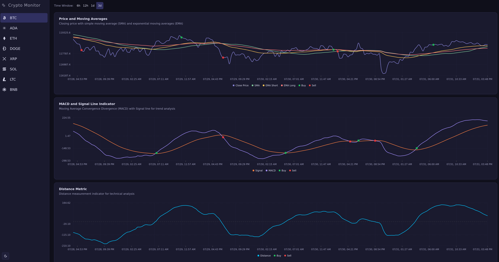

# embedded-crypto-monitor
Crypto market monitor in C++, explicitly made for embedded systems with low resources.

Generates live predicitions on when to buy/sell cryptocurrencies based on different strategies.

You can access the web application at [crypto-monitor.nontasbak.com](https://crypto-monitor.nontasbak.com/).



## Metrics and Strategies
The project calculates several metrics, such as:
- **EMA** (Exponential Moving Average, Short and Long term)
- **SMA** (Simple Moving Average)
- **Pearson** (Pearson correlation coefficient)
- **MACD** (Moving Average Convergence Divergence)
- **Signal** (Signal line for MACD)
- **Distance** (Distance between MACD-Signal)

And uses them to generate buy/sell signals based on strategies explained in the [report](docs/report.pdf).

## Installation and Usage

Install the necessary dependencies (on debian/ubuntu) with:
```bash
sudo apt install nlohmann-json3-dev libcpp-httplib-dev libwebsockets-dev
```

Compile the project with
```bash
make
```

Finally, run it with
```bash
make run
```

## Cross Compilation on RPI

You will need to transfer the necessary libraries from the RPI to your host machine, in a directory called `sysroot-rpi`.
Check the `Makefile` for more details.

To cross compile for the RPI, run
```bash
make rpi
```

To run it continously
```bash
nohup ./crypto_monitor_rpi &
```

## Author
Epameinondas Bakoulas

Class: Real Time Embedded Systems with professor Nikolaos Pitsianis

July 2025


> [!NOTE]
> The Javascript (node.js) version with a PostgreSQL database can be found [here](https://github.com/NontasBak/crypto-monitor).
> 
> The current repository is for the C++ version.